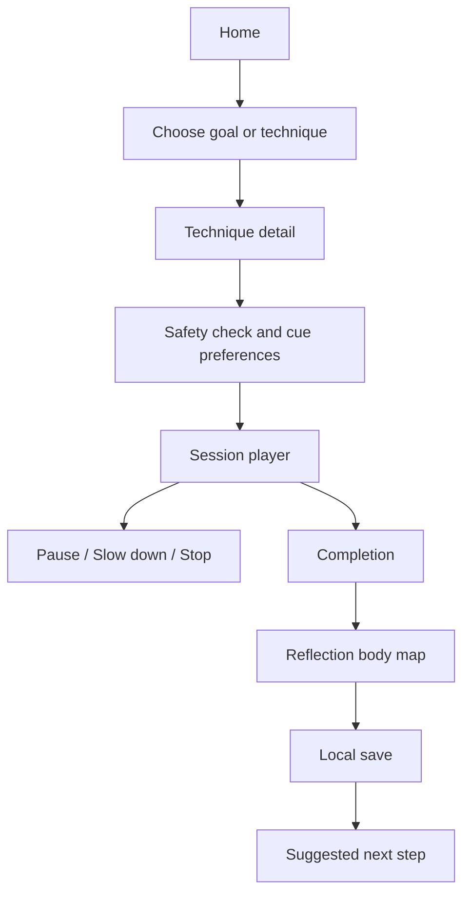
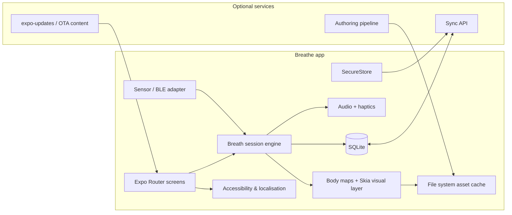

# Breathe

## Executive summary

If I build **Breathe** as an offline-first Expo native app, I should treat it as a **wellness and contemplative practice application with carefully bounded health claims**, not as a diagnostic or medical tool. The strongest scientific foundation is **slow, comfortable breathing**, usually nasal and diaphragmatic, with a rate often guided towards about **5–7 breaths per minute** when the goal is autonomic regulation or HRV-oriented practice. The wider evidence base for mindfulness-style meditation is also credible, especially for stress, anxiety and mood-related outcomes, although effects are generally modest rather than transformative. By contrast, branded or highly specific patterns such as **box breathing**, **4-7-8**, and especially **Wim Hof-style cyclic hyperventilation with retention** have either a narrower evidence base or a materially higher safety burden. citeturn0search3turn0search7turn0search0turn14search6turn2search1turn2search0turn2search3turn3search2

The most robust product framing is a **three-layer model**. First, a **physiology layer** shows timing, posture, airflow, diaphragmatic motion and, if I later add external sensors, carefully labelled physiological metrics. Second, a **felt-sense layer** lets me record how breath or meditation is experienced in the body using body maps and subjective descriptors such as tightness, warmth, tingling, openness or steadiness. Third, a **symbolic or traditional layer** can present practices in terms of prāṇa, qi, energetic channels, visualisation, mantra or tradition-specific meaning, but it should be clearly labelled as **traditional, reflective or belief-based**, not as measured anatomy. That separation lets me support spiritual and symbolic use-cases without making unsupported medical claims, which matters both scientifically and for Apple and Google policy compliance. citeturn0search9turn15search1turn15search3turn20search1turn20search0turn20search3turn9search0turn10search0

On the implementation side, I would begin with **Expo using Continuous Native Generation and `expo prebuild`**, because Expo now treats the old managed-versus-bare split as deprecated. For Breathe, the most sensible baseline stack is **Expo Router**, **Reanimated**, **Skia**, **expo-audio**, **expo-haptics**, **expo-sqlite**, **expo-file-system**, **expo-secure-store**, and **expo-localization**, with BLE and custom native modules added only if and when external physiological hardware becomes part of the validated product scope. Because platform versions, target devices and monetisation are **unspecified**, I should keep compatibility decisions explicit and configurable rather than hard-coded into the product concept. citeturn4search0turn4search4turn4search9turn17search1turn16search1turn4search2turn21view4turn21view2turn7search25turn6search3turn21view3turn7search0

## Scope, assumptions and design stance

Because **platform versions, target devices and monetisation are unspecified**, my recommendations here are intentionally **architecture-first and policy-aware** rather than tied to one release train or commercial model. I therefore treat Breathe as a product that should work fully offline on current Android and iOS devices, with optional sync and optional sensor integrations added later rather than assumed from day one.

If I want Breathe to include **belief-based, symbolic and traditional narratives**, I should not try to collapse everything into one truth-claim. NCCIH describes yoga as rooted in Indian philosophy and notes that contemporary yoga commonly includes **postures, breathing techniques and meditation**; NCCIH likewise describes qigong as combining **gentle movement, mental focus and deep breathing**, including breath directed to specific parts of the body. Meditation traditions frequently use attention to **breath, sound, imagery or mantra**. That means a product can legitimately support symbolic and contemplative framing, but it should present such framing as **practice context**, not as clinically verified biophysics. citeturn20search1turn20search0turn20search3turn20search4

My core design stance would therefore be:

| Layer | What I would show | What I would not claim |
|---|---|---|
| **Physiology** | Breath rate, phase timing, posture, nasal vs mouth cueing, diaphragm/belly expansion, optional measured heart-rate trends | That I am visualising “energy” as an anatomical entity |
| **Felt sense** | Subjective body maps, journal descriptors, emotional tone, interoceptive check-ins | That subjective maps are objective diagnostics |
| **Symbolic / traditional** | Prāṇa, qi, chakric or channel imagery, mantra, devotional or contemplative framing, guided imagery | That symbolic maps are medically established structures |

That three-layer model is not just philosophically tidy; it is also the safest way to support belief-based use without triggering misleading health claims. Apple’s App Review Guidelines and Google Play’s Health Content and Services policy both emphasise sensitivity around health data, misleading medical functionality, privacy disclosures and clear disclaimers where an app is **not** a medical device. citeturn9search0turn10search0turn8search1turn8search3

## Evidence base and technique analysis

The physiological foundation for Breathe should centre on **respiration mechanics and autonomic coupling**. Slow breathing changes intrathoracic pressure, baroreflex dynamics and respiratory sinus arrhythmia; the diaphragm remains the principal muscle of quiet breathing, so a visual design that shows **abdominal / diaphragmatic excursion** is closer to real respiratory mechanics than a generic floating sphere alone. Reviews of slow breathing report effects across the respiratory, cardiovascular and autonomic systems, and respiratory sinus arrhythmia reflects the close coupling between breathing phase and beat-to-beat heart timing. citeturn0search3turn3search3turn3search7

If I use HRV in Breathe, I should do so conservatively. The HRV standards literature and later methodological reviews make clear that **HRV is useful but easy to oversimplify**: recording conditions, artefact handling, breathing rate, posture, sampling method and reporting conventions all matter. In other words, I should not display a single “calm score” without explaining what was measured, how it was measured, and what its limits are. If HRV is shown at all, it should be framed as **contextual biofeedback**, not a medical judgement about nervous-system health. citeturn3search0turn3search12turn3search13turn3search17turn3search8

The broader intervention literature is supportive but heterogeneous. Slow voluntary breathing has a good evidence base for short-term autonomic and HRV effects, and breathing exercises also show modest average reductions in blood pressure in meta-analysis. Diaphragmatic breathing appears useful for stress-related outcomes and may improve respiratory efficiency and perceived stress in some populations. Mindfulness and meditation programmes show small-to-moderate benefits for anxiety, depression and stress-related well-being, but body scan by itself is often weaker than a broader multi-component programme. Adverse effects from meditation are possible, ranging from transient anxiety or distress to rarer but clinically important experiences in vulnerable users, so Breathe should be **trauma-aware and exit-friendly**. citeturn0search0turn13search14turn14search28turn0search15turn2search1turn2search2turn2search3turn2search15

### Technique comparison

The evidence levels below are **product-oriented judgements**: they reflect how defensible each technique is as an app feature for general users, not a formal clinical guideline.

| Technique | Evidence level | Contraindications and safety notes | Typical session structure | Visualisation suggestions |
|---|---|---|---|---|
| **Slow diaphragmatic / resonance-style breathing** | **High** for autonomic regulation, RSA/HRV effects, relaxation and stress reduction. Slow breathing reviews and meta-analysis are consistently supportive, especially around ~5–7 breaths/minute. citeturn0search3turn0search7turn0search0turn14search23 | Keep it comfortable rather than forceful. Over-breathing can still provoke dizziness or hypocapnic symptoms in sensitive users. citeturn3search2 | Settle 60–90 sec → paced inhale/exhale for 5–15 min → quiet rest 30–60 sec | Diaphragm dome, abdominal bloom, rib halo, exhale-led settling wave |
| **Box breathing / square breathing / tactical breathing** | **Moderate** for stress-management usefulness, but **limited direct evidence** for the square pattern itself compared with generic slow breathing. Tactical breathing has some performance/stress evidence. citeturn14search3turn14search5turn14search1 | Holds can feel effortful or panic-provoking; offer a no-hold variant. For beginners, default to shorter counts. citeturn14search1turn3search15 | 3-3-3-3 or 4-4-4-4 for 3–8 min | Orb moving around a square; haptic tick at each corner; large phase labels |
| **4-7-8 breathing** | **Moderate-low**. Some studies report HRV, blood-pressure or anxiety benefits, but comparative work suggests simpler 6-bpm breathing may often be more effective for HRV. citeturn14search2turn14search25turn14search1 | Longer holds may be difficult for anxious, dizzy or respiratory-sensitive users; not ideal as the first onboarding technique. citeturn14search2turn3search15 | 4s inhale → 7s hold → 8s exhale for 4–8 cycles | Thin inhale stream, suspended glow during hold, long descending exhale ribbon |
| **Alternate nostril breathing / Nadi Shodhana / Anulom Vilom** | **Moderate**. Prāṇāyāma reviews support autonomic and cardiovascular effects overall, but the mechanism and nostril-specific claims remain inconsistent. citeturn13search5turn13search10turn13search25 | Avoid forcing through congestion; avoid exaggerated claims about hemisphere control or detoxification. citeturn13search5 | Finger-placement tutorial → alternating cycles for 5–10 min → short rest | Left/right nasal airflow trace; channel-swapping animation; optional traditional overlay |
| **Bhrāmarī / humming breathing** | **Moderate-low but promising**. Humming markedly increases nasal nitric oxide output experimentally; reviews suggest parasympathetic bias and encouraging health effects, but the clinical evidence is still modest. citeturn1search1turn13search3turn13search17 | Keep humming gentle; stop if jaw, ear, throat or facial pressure becomes unpleasant. | Nasal inhale 3–5s → humming exhale 5–10s for 3–10 min | Sinus / face resonance glow, visible sound wave, vibrating exhale line |
| **Buteyko / reduced-breathing retraining** | **Condition-specific moderate**. Best supported for some asthma-related outcomes such as reduced reliever use and quality-of-life improvements; weaker as a universal wellness method. citeturn1search7turn1search5turn1search6turn13search15 | Must **not** replace prescribed asthma medication or acute care. Not suitable for acute respiratory distress. citeturn1search6turn13search15 | Education → gentle nasal / quieter breathing → brief pauses only if comfortable and clearly guided | Minimal pacer, shrinking amplitude, nasal-only cueing, “less air, more ease” metaphor |
| **Wim Hof-style cyclic hyperventilation with retention** | **Low-to-moderate for general wellness app use**. There is mechanistic evidence for sympathetic activation and inflammatory effects, but it has a substantially higher risk profile and a thinner general-use outcomes base. citeturn1search3turn14search6 | Highest-caution technique. Risk of light-headedness, tingling, presyncope or fainting; never near water, bathing, driving or standing unsupported. Users with syncope, seizures, cardiovascular disease, pregnancy, respiratory disease or high panic sensitivity should avoid or seek medical advice first. citeturn3search2turn10search0 | If included at all: advanced-only, safety gate, seated/lying, manual start, no retention competitions | Very plain phase bars; overt safety banner; no immersive trance visuals |
| **Guided breath awareness / mindfulness / body scan** | **Moderate**. Meditation programmes are supported for stress-related outcomes; body scan works best as part of a broader mindfulness offering rather than alone. citeturn2search1turn2search2turn2search0 | Low risk for many users, but distress, dissociation, anxiety or traumatic re-experiencing can occur. Offer grounding, shorter options and a clear stop path. citeturn2search3turn2search15turn2search19 | 5–20 min: posture → anchor attention → guided noticing → brief reflection | Progressive body spotlight, front/back body map, text-only mode, soft chime/haptic transitions |

My default onboarding sequence should therefore be: **slow diaphragmatic breathing**, **guided breath awareness**, and **gentle humming** first; **box** and **4-7-8** as structured intermediate options; **Buteyko** only with proper educational framing; and **Wim Hof-style hyperventilation** only if I deliberately choose to support advanced, clearly gated, high-caution content. That ordering is the best match to both evidence quality and safety. citeturn0search0turn14search6turn2search0turn10search0

## Personas, accessibility and symbolic experience design

Breathe should support at least four distinct user modes. The **stressed general user** wants a quick reset before sleep or work. The **curious beginner** needs reassurance, low jargon and gentle pacing. The **practice-oriented user** wants correctly named techniques, tradition and lineage-sensitive context, and optional symbolic overlays. The **access-sensitive user** may have visual, auditory, cognitive, vestibular or trauma-related needs and therefore requires radically adaptable rather than merely attractive guidance. That last group should shape the baseline design, not a separate “accessibility mode”, because timed sensory experiences can easily become exclusionary when motion, sound or urgency are overused. WCAG 2.2 emphasises perceivable, operable, understandable and robust experiences, and its guidance on timing is especially relevant for a session player built around cadence and transitions. citeturn5search2turn5search8turn5search12

In React Native, I can support this with the platform accessibility stack rather than reinventing it. React Native’s accessibility APIs support semantic labels, hints, roles and live regions; `AccessibilityInfo` can query **screen-reader state**, **reduce motion**, **high text contrast** and the user’s **recommended accessibility timeout**. That means Breathe can announce phase changes to VoiceOver/TalkBack, respect Android’s “time to take action” setting, detect reduced-motion preferences, and switch from particle-rich animations to cross-fades or static cues when needed. I should also use `accessibilityLanguage` with proper **BCP 47** tags for multilingual content fragments in chants, Sanskrit terms or translated cues. citeturn21view1turn21view0turn22view0turn22view1turn22view2turn22view3

Apple’s motion guidance reinforces the same direction: frequent UI interactions should avoid excessive motion, and reduced-motion support should disable or change spinning, vortex-like or ongoing motion effects. In an app about bodily regulation, this matters even more, because certain visual metaphors for “energy movement” can become overstimulating or even nauseating. I would therefore design every session cue in at least **four modalities**: text, shape, optional sound, optional haptic. Colour alone should never carry a phase change. citeturn5search3turn5search13turn21view4

For symbolic and traditional narratives, I would use an explicit **mode switch** rather than mixing all metaphors together. One mode might be **Body & Breath**, using anatomy-adjacent language such as nose, chest, diaphragm, abdomen and pace. A second mode might be **Felt Sense**, using warmth, expansion, steadiness, openness or release. A third mode might be **Tradition**, using terms such as prāṇa, qi, mantra, channel or devotional focus where appropriate. NCCIH’s descriptions of yoga, qigong and meditation are useful here because they confirm that breath, visual imagery and spiritual practice legitimately coexist in mind-body traditions; the platform policies then tell me how to present them without drifting into misleading medical functionality. citeturn20search1turn20search0turn20search3turn10search0turn9search0

### Wireframe and flow suggestions

I would keep the navigation shallow and goal-led:

| Screen | Purpose | Key components |
|---|---|---|
| **Home** | Resume, quick start, daily rhythm | Continue tile, “Calm now”, “Sleep”, “Focus”, “Traditional practice”, recent reflections |
| **Library** | Browse by goal or technique family | Filters for duration, difficulty, posture, sensory mode, tradition, evidence framing |
| **Technique detail** | Clarify what I will do and why | Summary, safety notes, duration options, cue options, tradition toggle, sample visual |
| **Session player** | Run the practice | Large phase cue, elapsed/remaining time, pause/slow/stop, audio/haptic toggles |
| **Reflection** | Capture subjective experience | Felt-sense body map, free text, dizziness/distress check, “save locally” |
| **Safety & settings** | Make sensory and medical limits explicit | Accessibility settings, content gating, privacy, disclaimer, offline packs |

A compact user-flow looks like this:

## Content taxonomy and embodied UX patterns

If I want the library to feel coherent, I should make the **goal taxonomy** primary and the **technique taxonomy** secondary. The top-level goals I would recommend are **Calm**, **Focus**, **Sleep**, **Recovery**, **Energy / activation**, **Breath mechanics**, **Meditative awareness**, and **Traditional practice**. Each session then carries structured metadata: canonical name, aliases, technique family, tradition, evidence framing, contraindications, posture, phase pattern, breath route, sensory mode, difficulty, duration band, and intended goals.

The most distinctive Breathe interaction should be the **embodied body map**, because body-mapping research supports the idea that people can reliably report structured bodily feeling patterns, and interoception research provides a credible language for subjective internal experience. That does **not** prove that an app can display “energy” as a measured physiological substance, but it does justify a front/back body silhouette where I can record where breath is noticeable or where meditation changes how I feel. This is the right design territory for phrases like “How did the exhale feel in your body?” or “Where did the humming resonate most strongly?” citeturn15search1turn15search2turn15search3turn0search9turn0search6

For the live session player, I would use a layered cue model:

| Cue type | Recommended pattern | Why it fits Breathe |
|---|---|---|
| **Body map** | Static silhouette with region highlights | Embodied, low-cognitive-load, good for reflection |
| **Phase animation** | Expand / hold / settle / rest transitions | Maps cleanly to inhale, pause, exhale, rest |
| **Haptics** | Short taps at transitions; softer feedback on exhale or completion | Supports eyes-free use and Deaf / hard-of-hearing users |
| **Audio** | Spoken guidance, soft chimes, optional ambient bed, captions always available | Supports immersion but stays optional |
| **Text prompts** | Short phrases, not essays | Better for regulation than verbose coaching |

I would avoid over-designed “energy” effects such as constantly moving particles, swirling tunnels, or pulsing neon body outlines in the default mode. Those may look dramatic, but they can clash with accessibility settings, increase battery draw, and imply an unmeasured precision that the product does not really have. A better visual grammar is **subtle expansion, directional attention, and region-specific highlighting**.

## Expo architecture, libraries and offline data strategy

Technically, I would start with **Expo CNG / prebuild**, because Expo now explicitly states that the old “managed” and “bare” workflows are deprecated and that projects use the same architecture based on **Continuous Native Generation**. When I need native access, I generate the native directories with `npx expo prebuild` and customise through config plugins or the Expo Modules API. That approach is ideal for Breathe because I can remain highly productive at MVP stage, but I still have a clean path to native code for encryption, BLE or custom sensor modules later. citeturn4search0turn4search4turn7search22turn7search0

### Recommended library stack

| Concern | Recommended library | Why I would pick it |
|---|---|---|
| Navigation | **Expo Router** | File-based routing, native navigation support, and first-class Expo integration. citeturn4search9 |
| Core animation | **react-native-reanimated** | UI-thread worklets and high-performance animations suited to a long-running session player. citeturn17search1turn17search15 |
| High-performance drawing | **React Native Skia** | Best fit for body maps, custom breath curves and rich but efficient 2D graphics. citeturn16search1turn16search5 |
| Gestures | **react-native-gesture-handler** | Native-thread gesture recognition for sliders, scrubbing and embodiment interactions. citeturn11search21 |
| Audio | **expo-audio** | Current Expo audio API for playback and recording, replacing the older `expo-av` Audio path. citeturn4search2turn4search11 |
| Haptics | **expo-haptics** | Simple cross-platform access to vibration / Taptic feedback. citeturn21view4 |
| Local DB | **expo-sqlite** | Durable structured offline storage; optional SQLCipher support with prebuild. citeturn21view2 |
| File storage | **expo-file-system** | Persistent local media storage and downloadable packs; document directory is intended for files safe from system deletion. citeturn7search25turn6search11 |
| Secrets | **expo-secure-store** | Good for small secrets and credentials; not for large blobs. citeturn6search3turn6search7 |
| Localisation | **expo-localization** + **react-i18next** or **Lingui** | Expo exposes locale data and explicitly recommends pairing with a localisation library. citeturn21view3turn11search2 |
| Sensors | **expo-sensors** | Available access to accelerometer, gyroscope, device motion and related sensors. citeturn6search1turn6search13 |
| Offline update channel | **expo-updates** | OTA code / content updates when I choose to add them. citeturn4search10 |
| Background sync | **expo-background-task** | Deferrable background tasks designed to optimise battery and power use. citeturn7search1 |
| Schema validation | **Zod** | Strong TypeScript-first validation for authored content and sync payloads. citeturn16search3turn16search7 |
| BLE | **react-native-ble-plx** behind an adapter | Widely used React Native BLE library, but because BLE is community-maintained and native-sensitive, I would wrap it behind my own interface rather than scattering it through the app. citeturn16search2turn16search6 |

I would favour a **session engine** built on Reanimated worklets and Skia graphics. Reanimated’s core value is that animations run on the **UI thread**, which is exactly what I want for a pacer that must stay smooth even if the JavaScript thread is busy with logging or content lookups. React Native’s performance guidance still centres on maintaining smooth frame rates, and Breathe is precisely the kind of foreground, animation-heavy app where jank is highly noticeable. citeturn17search1turn6search0

### Proposed client architecture

For storage, I would use a strict separation of concerns. **SQLite** holds structured content, user settings, contraindication rules, localised metadata and session logs. **FileSystem** holds voice packs, ambient tracks, illustrations, cached cue bundles and downloaded locale media. **SecureStore** holds only small secrets or encryption-related items. If I later need encrypted relational storage, Expo SQLite’s **SQLCipher** support is the cleanest path, but that requires prebuild and is not supported in Expo Go. citeturn21view2turn7search25turn6search3

### Proposed data schema

This is the schema I would design first, before I start writing session UI.

| Table / collection | Key fields | Notes |
|---|---|---|
| `technique` | `id`, `slug`, `canonicalName`, `family`, `tradition`, `summary`, `evidenceLevel`, `beliefModeAllowed` | Master entry for each practice |
| `technique_alias` | `techniqueId`, `locale`, `alias` | Supports multiple names such as Nadi Shodhana / alternate nostril |
| `technique_goal` | `techniqueId`, `goalCode`, `strength` | Many-to-many link between practices and goals |
| `contraindication_rule` | `id`, `techniqueId`, `severity`, `conditionCode`, `messageKey` | Drives warnings and content gating |
| `session_template` | `id`, `techniqueId`, `durationSec`, `difficulty`, `posture`, `phaseJson` | Runnable practice blueprint |
| `phase` | `templateId`, `seq`, `type`, `seconds`, `cueStyle`, `bodyRegionCode` | Normalised session steps if I do not want JSON blobs |
| `media_asset` | `id`, `kind`, `locale`, `uri`, `bundled`, `checksum`, `licence`, `attribution`, `durationMs` | Tracks downloadable and bundled media |
| `translation_string` | `key`, `locale`, `value`, `rtl` | Alternative to JSON i18n files if I want content in SQLite |
| `user_profile` | `id`, `experienceLevel`, `goalsJson`, `safetyFlagsJson`, `beliefModePref` | Minimal offline profile |
| `accessibility_pref` | `userId`, `reduceMotionOverride`, `screenReaderMode`, `captionDefault`, `hapticsDefault`, `fontScale`, `contrastTheme` | Merges system and app preferences |
| `practice_session` | `id`, `templateId`, `startedAt`, `endedAt`, `completionState`, `notes`, `localeUsed` | Core session log |
| `session_event` | `id`, `sessionId`, `tsMs`, `eventType`, `payloadJson` | Pause, resume, stop, speed change, safety exit |
| `body_map_entry` | `id`, `sessionId`, `bodyRegionCode`, `intensity`, `valence`, `qualityTagsJson` | Subjective felt-sense capture |
| `sensor_summary` | `id`, `sessionId`, `source`, `metricCode`, `windowStart`, `windowEnd`, `value`, `qualityFlag` | Optional HR / HRV / motion summaries |
| `sync_oplog` | `opId`, `tableName`, `recordId`, `opType`, `modifiedAt`, `syncState`, `deviceId` | Supports optional sync later |
| `content_version` | `version`, `createdAt`, `channel`, `checksum` | Lets me patch content separately from app code |

My sync model would be **offline-first and optional**. Version one should work with **no account and no network**. Version two can add an **append-only oplog** for session data and preferences. If I do add cloud sync, I would sync small structured records rather than raw audio or high-frequency sensor data. Code updates and content updates should remain logically separate: `expo-updates` can distribute app and content changes, while user records sync only when I deliberately enable that feature. citeturn4search10turn7search1turn7search18

Performance and battery deserve deliberate engineering. React Native’s performance guidance still centres on frame rate, and Reanimated / worklets are helpful because they keep animation logic off the busy JS path. Breathe should unsubscribe from sensors when a screen blurs, use **KeepAwake** only during active sessions when the screen must stay on, and downgrade expensive visuals when reduced motion is enabled or low-power conditions are detected. I also need to remember that Expo Haptics can do nothing on iOS in **Low Power Mode**, so haptics must always be optional rather than safety-critical. citeturn6search0turn17search1turn6search2turn21view4

## Privacy, disclaimers, localisation and media operations

From a compliance standpoint, the safest launch posture is: **offline by default, minimal permissions, no third-party analytics unless clearly justified, and no diagnosis/treatment claims**. Apple requires a privacy policy link in App Store metadata and in the app itself, and its health guidance treats health and fitness data as especially sensitive. Google Play similarly requires a privacy policy and, for health-related functionality, a Health apps declaration and a clear disclaimer when the app is **not** a regulated medical device. If I later read from or write to Health Connect or HealthKit, the product enters a more tightly governed space and should be treated as such. citeturn9search0turn8search3turn8search9turn10search0turn8search6turn10search8

A compliant disclaimer model for Breathe would be explicit and repeated, not buried. In store copy and in-app, I would say that Breathe is for **well-being, education and contemplative practice**, that it is **not a medical device**, and that it does **not diagnose, treat, cure or prevent** any medical condition. For more intense practices, I would add targeted warnings, for example that hyperventilation or long retentions must not be performed in water, while driving, or by users with certain health risks without medical advice. This is directly aligned with Google Play’s policy wording and Apple’s emphasis on credible, non-misleading health functionality. citeturn10search0turn8search20turn9search0

For localisation, I should separate **UI localisation** from **content localisation**. UI strings can live in a conventional i18n layer such as `react-i18next` or Lingui, paired with `expo-localization`. Practice content should have its own locale-aware metadata, because breath techniques often involve multiple name forms, transliteration, pronunciation notes and tradition-sensitive glossaries. React Native’s `I18nManager` supports RTL layout, and the accessibility API supports BCP 47 language tags for spoken labels. That means Breathe can correctly handle English UI with Sanskrit or Arabic phrase fragments without confusing screen readers. citeturn21view3turn11search1turn22view3

For content authoring, I would create a **versioned pipeline** rather than hand-editing JSON in the app. My preferred flow would be: author in Markdown/MDX or Google Sheets export → validate with Zod → compile to JSON / SQLite seed → generate a media rights manifest → bundle the essential content in the app → optionally ship larger voice and illustration packs later through offline downloads stored with FileSystem. This is easier to edit, easier to review clinically or traditionally, and far safer for localisation than scattering content across components. Expo’s asset system and file system are well suited to this approach. citeturn16search3turn16search7turn7search3turn7search25

For media, I would strongly prefer **commissioned or fully open-licensed assets**. Creative Commons’ own chooser and licence pages make the commercial and attribution implications clear; Openverse provides large collections of CC and public-domain media but warns that licence metadata should still be verified; Unsplash offers a permissive licence for images; Google Fonts and Material Symbols are practical sources for typography and iconography. Because monetisation is unspecified, I should avoid relying on **CC BY-NC** assets unless I am comfortable permanently constraining commercial use. citeturn12search0turn12search8turn12search4turn12search1turn12search17turn12search2turn12search18turn12search3turn12search27

## Testing, validation and implementation roadmap

My testing strategy should have **three layers**. First, **product correctness**: unit tests for session timing, content parsing, contraindication rules, and migration logic using `jest-expo`. Second, **UI and accessibility flow testing**: Maestro is particularly attractive for Breathe because it operates at the UI/accessibility layer with a single test suite across Android and iOS, while Detox remains stronger if I later want deeply instrumented end-to-end testing. Expo documents Maestro on EAS Workflows directly, and Detox’s own documentation notes Expo integration as a community path. Third, **physiological validation**: if I claim pacer accuracy, HRV usefulness or measured response, I should validate timing and signals against accepted HRV methodology rather than assuming the phone alone is enough. citeturn18search3turn18search10turn18search0turn18search2turn18search15turn18search1turn18search8turn3search0turn3search13

For physiological validation, I would not start with camera-only or phone-only measurement claims. A better route is to validate against an external **RR-capable chest strap** or a research-grade ECG path. Polar’s official material positions the H10 as capable of RR interval output over BLE and provides research documentation around RR accuracy and access to raw/online data; that makes it a plausible developer-facing reference device for a BLE integration or validation harness. If I later build “biofeedback” features, I should validate cue timing, artefact handling and metric interpretation before surfacing any strong user-facing conclusions. citeturn19search9turn19search0turn19search6

### Implementation roadmap

| Milestone | Scope | Effort | Priority |
|---|---|---|---|
| **Foundation and evidence model** | Define goals, technique taxonomy, terminology policy, disclaimer model, contraindication rules, initial content schema | Medium | High |
| **Session engine MVP** | Paced breathing player, pause/slow/stop controls, voice cues, haptics, local session logging | High | High |
| **Embodied UX MVP** | Front/back body map, reflection flow, inhale/exhale phase visuals, reduce-motion path | High | High |
| **Offline data layer** | SQLite schema, migrations, asset manifest, file caching, secure key handling | Medium | High |
| **Accessibility hardening** | Screen-reader announcements, accessibility timeouts, contrast themes, captions, haptic/audio alternatives | Medium | High |
| **Core content library** | Slow breathing, guided breath awareness, body scan, humming, box, 4-7-8, alternate nostril | Medium | High |
| **Traditional and symbolic layer** | Physiology / felt-sense / tradition mode switch, glossary, optional symbolic overlays, lineage notes | Medium | Medium |
| **Advanced content gating** | Buteyko education, advanced holds, hyperventilation safety locks, opt-in warnings | Medium | Medium |
| **Optional sync and OTA content** | Oplog sync, conflict policy, downloadable voice packs, OTA content releases | Medium | Medium |
| **BLE and validation harness** | External HR / RR integration, signal summary tables, debugging screens, lab validation workflow | High | Medium |
| **Release validation** | Usability testing, accessibility audit, battery profiling, store listing compliance review | Medium | High |

The most important success criterion is not that Breathe looks mystical or hyper-polished. It is that it is **credible, safe, embodied, offline-capable and configurable**. If I get the session engine, the contraindication model, the body-map interaction and the sensory accessibility right, I will have the foundations of a genuinely differentiated breathing and meditation app. If I then layer in symbolic and traditional narratives with honest labelling, I can support both evidence-oriented users and belief-oriented practitioners without confusing one for the other. citeturn0search9turn15search1turn20search1turn20search0turn10search0turn9search0